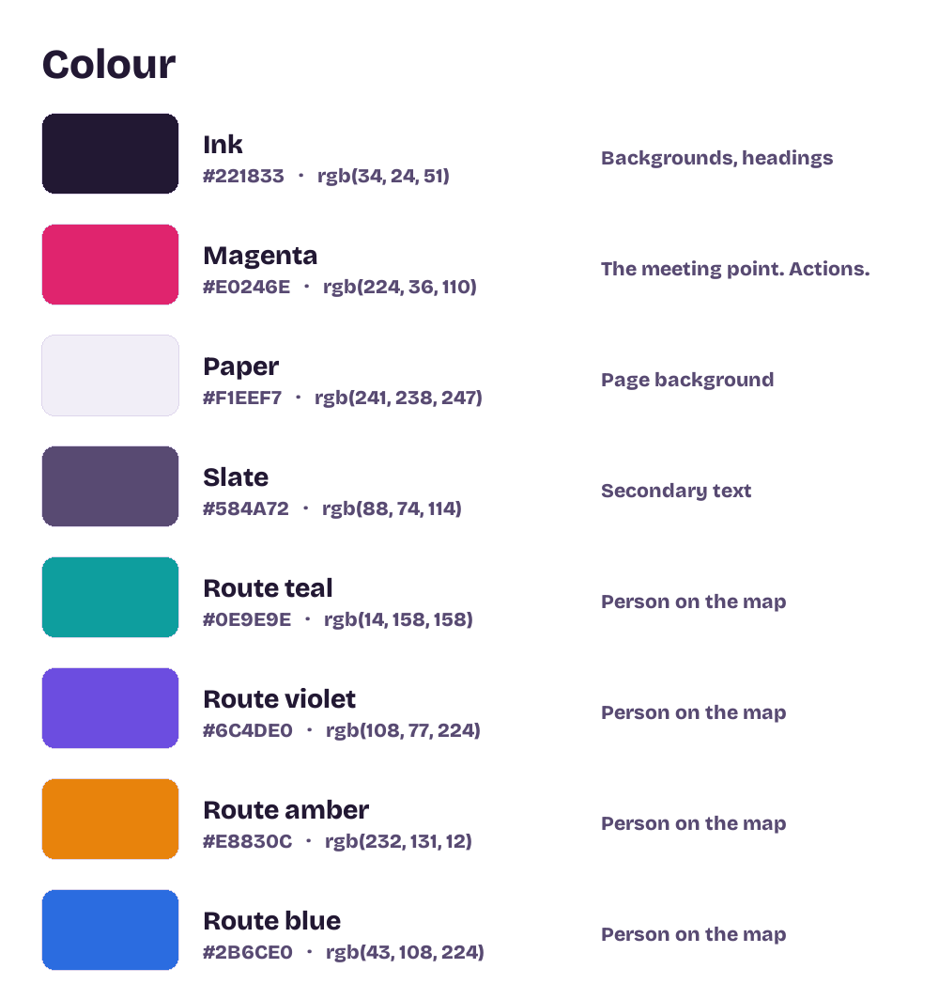

# We Rondayview — brand kit

Everything here was generated from the app itself, so what you hand a printer
matches what people see on the site.

---

## The mark

Four routes bending toward one point. It is the whole idea of the product in one
figure: everybody travels a little, everybody ends up in the same place. The four
colours are the same four the app uses for people on the map, so somebody who has
used it once already recognises the shape.

| File | Use it for |
|---|---|
| `logo/logomark.svg` | Anything that scales — print, signage, web. Start here. |
| `logo/logomark-1024.png` | Transparent. Drop onto any background. |
| `logo/logomark-512.png`, `-256.png` | Smaller transparent versions |
| `logo/logomark-on-ink-1024.png` | Pre-set on the dark background |
| `logo/logomark-on-white-1024.png` | Pre-set on white |

**Smallest size:** 24px on screen, 8mm in print. Below that the routes close up
and it reads as a dot.

**Clear space:** leave the width of the centre dot on every side. Nothing else in
that space.

---

## The wordmark

"We" in white or ink, "Rondayview" always magenta. Never both one colour — the
split is what makes it read as a name rather than a sentence.

| File | Background |
|---|---|
| `wordmark/wordmark-light.png` | Dark. Transparent PNG. |
| `wordmark/wordmark-dark.png` | Light. Transparent PNG. |
| `wordmark/wordmark-on-ink.png` | Pre-set on the dark background |

## The lockup

Mark and wordmark together, which is what you want on a business card, an
invoice, or the top of a flyer.

| File | Background |
|---|---|
| `lockup/lockup-light.png` | Dark |
| `lockup/lockup-dark.png` | Light |
| `lockup/lockup-on-ink.png` | Pre-set on the dark background |

---

## Colour



| Name | Hex | What it is for |
|---|---|---|
| **Ink** | `#221833` | Backgrounds, headings. The dark everything sits on. |
| **Magenta** | `#E0246E` | The meeting point, and every button that does something. Use it sparingly — it stops meaning "here" if it is everywhere. |
| **Paper** | `#F1EEF7` | Page background |
| **Slate** | `#584A72` | Secondary text |
| Route teal | `#0E9E9E` | Person 1 |
| Route violet | `#6C4DE0` | Person 2 |
| Route amber | `#E8830C` | Person 3 |
| Route blue | `#2B6CE0` | Person 4 |

The four route colours are a set. They are chosen to stay distinguishable from
one another on a pale map, so do not swap one out on its own.

---

## Type

| Role | Typeface | Where |
|---|---|---|
| Display | **Bricolage Grotesque**, 700–800, tight tracking (−0.03em) | The name, headlines, the meeting point |
| Body | **Inter**, 400–600 | Everything you read |
| Detail | **DM Mono**, 400–500, uppercase, wide tracking (0.13em) | Labels, distances, small print |

All three are free on Google Fonts, so a designer can install them at no cost:

```
fonts.google.com/specimen/Bricolage+Grotesque
fonts.google.com/specimen/Inter
fonts.google.com/specimen/DM+Mono
```

Bricolage Grotesque and DM Mono are SIL Open Font License; Inter is too. That
means you can use them commercially, embed them in the app, and send them to a
printer without buying a licence.

---

## Social

| File | Where |
|---|---|
| `social/og-image-1200x630.png` | The picture that appears when somebody shares a link |
| `social/avatar-square-1024.png` | Profile picture on any social account |

To make links unfurl with that image, add this to `index.html`'s `<head>`:

```html
<meta property="og:title" content="We Rondayview">
<meta property="og:description" content="Find a fair place to meet in the middle.">
<meta property="og:image" content="https://rondayview.com/brand/social/og-image-1200x630.png">
<meta property="og:url" content="https://rondayview.com/">
<meta name="twitter:card" content="summary_large_image">
```

---

## App icons

Already in `icons/` at the project root and wired into the manifest:
`icon-32`, `icon-180` (Apple), `icon-192`, `icon-512`, and a maskable 512 for
Android. If you ever need more sizes, they come from the same mark.

---

## Voice

Worth writing down, because it is the part a designer cannot infer from a logo.

The app is plain-spoken and slightly dry. It says *"Everybody drives a little.
Nobody drives all of it."* rather than *"Meet in the middle, effortlessly!"* It
admits when it does not know something — *"the venue directory did not answer"* —
instead of hiding it behind a spinner.

Keep that. Sentences that sound like a person explaining something, not a company
announcing something. No exclamation marks. Never call it a *journey*.

---

## What is not here

**A greyscale version.** The four route colours are the mark. In one colour it is
a circle with whiskers. If you need single-colour — an embossed card, a stamp —
have a designer draw a proper mono version rather than desaturating this one.

**Vector wordmark and lockup.** The PNGs are 200px tall, which covers screen use
and most print. For anything large, a designer can set it in Bricolage Grotesque
800 in about a minute — that is exactly what these were made from.
